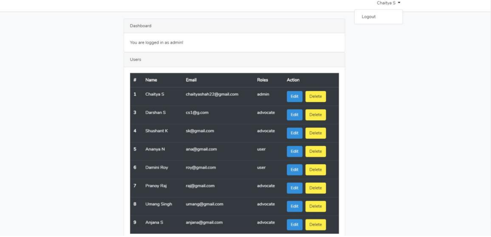
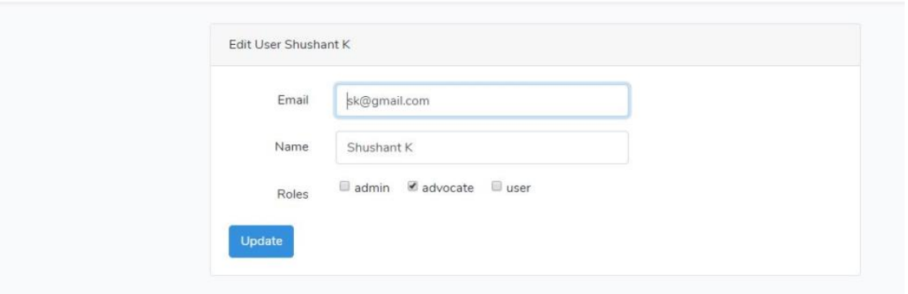
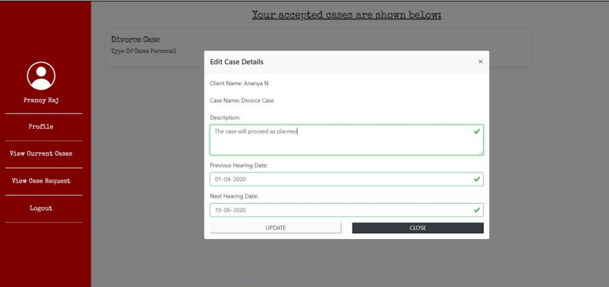
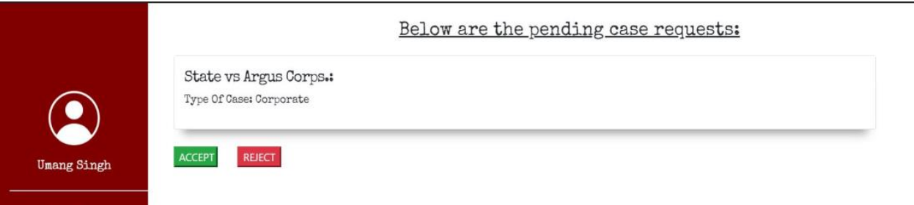
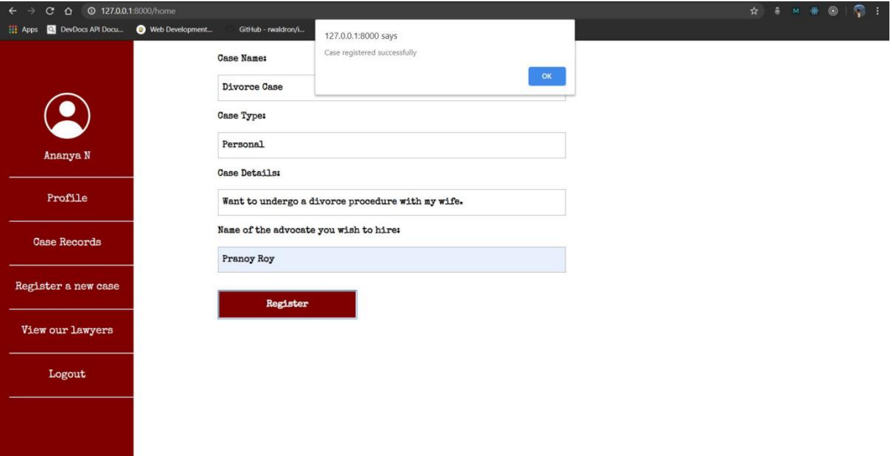
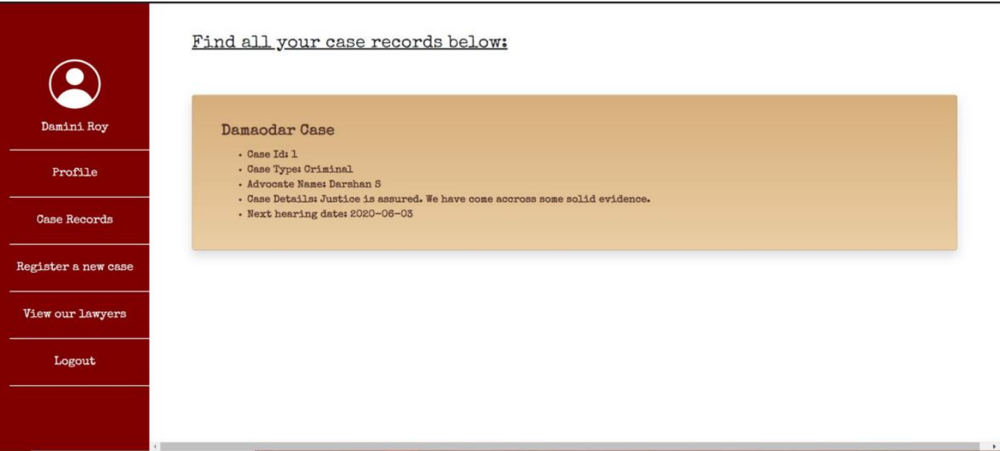
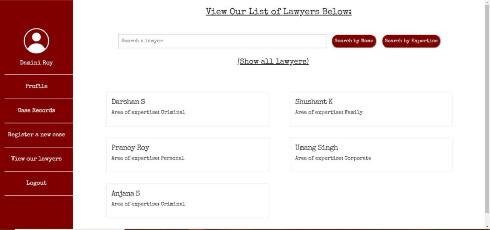
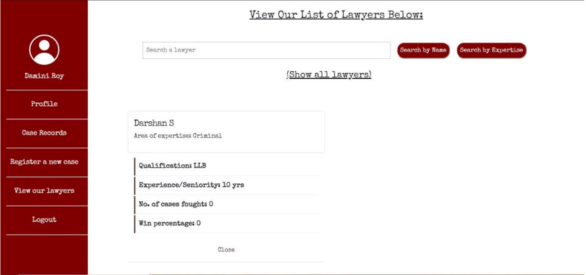
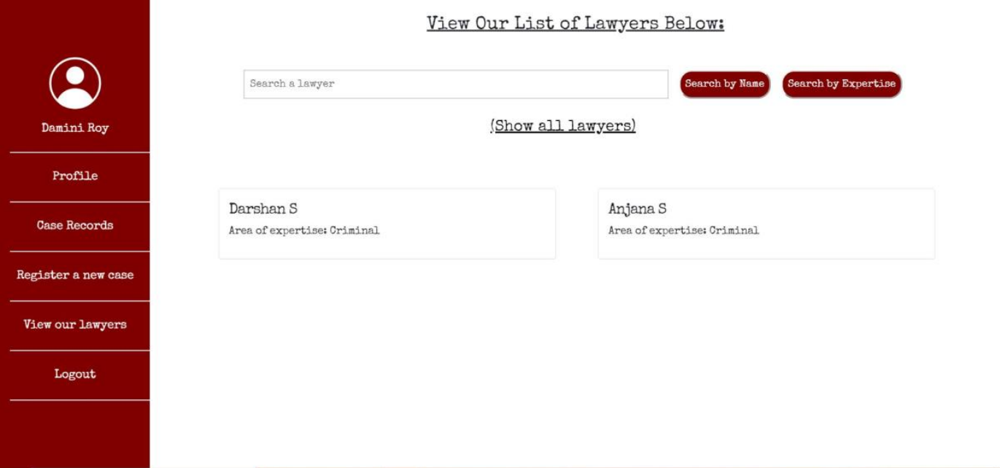

# Court Case Management System

## Introduction
This Laravel-based full-stack application is designed to streamline the management of court cases. It facilitates efficient handling of cases by enabling various stakeholders, including administrators, advocates, and clients, to interact seamlessly within the platform. 

## Features
- **Admin Dashboard:** Manage users, roles, and permissions with ease.
- **Advocate Management:** Advocates can view, update case details, and manage case requests.
- **Client Portal:** Enables clients to register new cases, view case status, and search for advocates based on expertise.

## Technology Stack
- **Frontend:** HTML, CSS, JavaScript (Bootstrap for responsive design)
- **Backend:** Laravel (PHP), MySQL
- **Tools:** Composer for Laravel package management, Git for version control.

## Getting Started
1. Clone the repository
2. Install dependencies: `composer install`
3. Configure your `.env` file for the database connection
4. Run migrations: `php artisan migrate`
5. Seed the database (if necessary): `php artisan db:seed`
6. Serve the application: `php artisan serve`
7. Navigate to `http://localhost:8000` in your web browser.

## Screenshots
Here are some snapshots of the application in action. These visuals help in providing a clear view of the user interface and the functionalities offered by the Court Case Management System.

### Admin Dashboard
Illustrates the admin interface for user and role management, showcasing the ability to oversee system activities efficiently.

### Advocate Interface
Displays the advocate’s functionality for case management, including viewing, updating, and managing case details and requests.

### Client Case Registration
Shows the client portal for new case registration, demonstrating how clients can easily submit and track their cases.

### Case Search and Management
Features the capability for clients to search for advocates by name or expertise, enhancing the matchmaking process between clients and legal professionals.

## Contributing
Contributions to the Court Case Management System are welcome! Please feel free to submit pull requests or open issues to discuss proposed changes or report bugs.

## Conclusion
This project not only showcases a practical application of the Laravel framework but also provides an essential tool for the legal industry, facilitating better case management and access to legal services.
